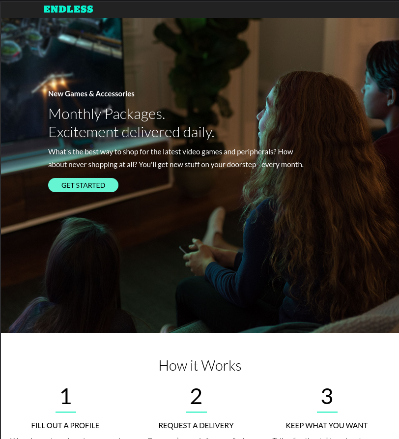
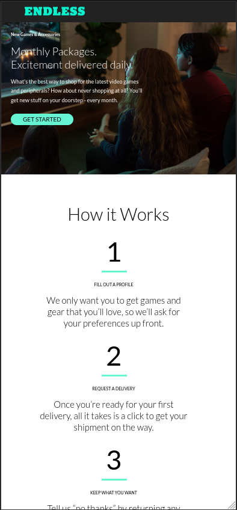

## Endless Comp Project

This was part of a programming challenge to build a landing page for a fictional company. The goal was to build out a project from scratch based on a starting image.
A REST API was used to generate the "How It Works" section.

## Table of Contents

- [Endless Comp Project](#endless-comp-project)
- [Desktop View](#desktop-view)
- [Tablet View](#tablet-view)
- [Mobile View](#mobile-view)
- [Table of Contents](#table-of-contents)
- [Installation](#installation)
- [Resources](#resources)
- [Next Steps (as of 4/11/2022)](#next-steps-as-of-4112022)
- [Questions](#questions)

## Desktop View

## Tablet View

## Mobile View

View the deployed application <a href = "https://young-lowlands-92384.herokuapp.com/">here</a>

## Installation

The application can be run in your local environment by:

1. Clone the repo/Download the zip file
2. Install required dependencies by running command `npm i` in a terminal window that has the application directory open
3. Run command `npm start` in your terminal

View the deployed application <a href = "https://young-lowlands-92384.herokuapp.com/">here</a>

## Resources

**React**  
**Custom REST API**  
**Axios**  
**Google Fonts**

## Next Steps (as of 4/11/2022)

1. implement testing

## Questions

If you have any further questions, feel free to reach out to me!  
<a href='https://www.github.com/serjykalstryke'>Github</a>  
<a href='mailto:davidstinnett@icloud.com'>davidstinnett@icloud.com</a>

## License
  GNU GENERAL PUBLIC LICENSE
